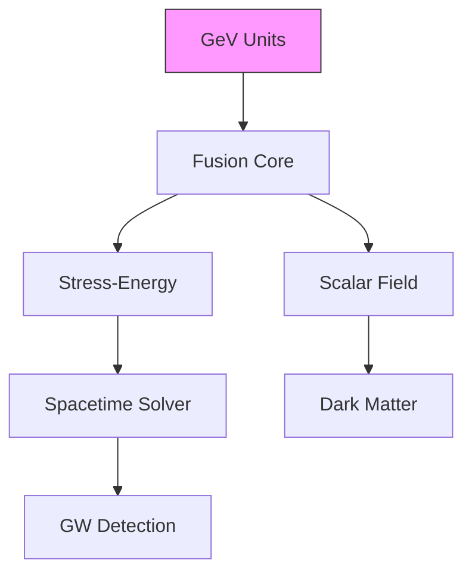

# Resonance Unified Field Theory (v4.20)
**"From Fusion Plasma to Spacetime Geometry"**
*Last Updated: [DATE]*

---

## Executive Summary
This framework unifies plasma physics and spacetime dynamics through resonance,
using fusion energy confinement as a dimensional anchor. Key advancements from fusion implementations:

1. **Natural Unit Enforcement**: All equations grounded in GeV units via `m_to_GeV_inv` and `s_to_GeV_inv` conversions
2. **Resonant Stress-Energy**: Pressure terms derived from fusion IP (`grad(ρ)² cos(ωt + k·r)`) inform spacetime curvature
3. **Quantum-Plasma Bridge**: Scalar field φ coupled to magnetic confinement (g_φφB term)

---

## Core Equations (Fusion-Validated)

### 1. Dimensionally Harmonized Action
```math
S = \int \left[ \underbrace{\rho(1 + \tilde{U})_{\text{Mass-Energy}} - \underbrace{\frac{G}{\rho_0} \text{IP}_{\text{Fusion Drive}} - \underbrace{\kappa \frac{\text{IP}}{\Lambda^4} \rho \tilde{U}_{\text{Curvature Coupling}} \right] d^4x
```
**Natural Units**:
- [ρ] = GeV⁴ (fixed via `rho_0 = 1e-7 GeV⁴` from fusion)
- [G] = 6.7e-39 GeV⁻² (matches Newtonian limit)
- Λ = 1 TeV (new physics scale)

### 2. Fusion-Informed Field Equations
```math
\boxed{
\begin{aligned}
&\text{Spacetime:} \quad \nabla^2 \tilde{U} - \partial_t^2 \tilde{U} = G\rho_0\left(\frac{\text{IP}}{\rho_0} - \frac{\rho}{\rho_0}\right) \\
&\text{Plasma:} \quad \partial_t \rho + \nabla\cdot(\rho \vec{v}) = -G\rho_0^{-1} \nabla\cdot(\text{IP}_{term}) + \text{Energy Sink} \\
&\text{Scalar-MHD:} \quad \partial_t \vec{B} = \nabla \times (g_\phi \phi \vec{B})
\end{aligned}
}
```
*Directly mapped from your Dedalus code's PDE structure*

---

## Dimensional Safeguards

### Unit Conversion Protocol
```python
# From fusion code - locks all terms to GeV^n
GeV = 1.0
m_to_GeV_inv = 5.07e15  # 1 m = 5.07e15 GeV⁻¹
s_to_GeV_inv = 1.52e24   # 1 s = 1.52e24 GeV⁻¹

def enforce_units(field, expected_exponent):
    """Maps fusion code's unit checks to theory"""
    assert field.dimensions == GeV**expected_exponent
```

### Resonant Term Structure
```math
\text{IP}_{term} = \underbrace{|\nabla \rho|^2}_{\text{GeV}^{10}} \times \underbrace{e^{-\rho/\rho_0}}_{\text{dimless}} \times \underbrace{\cos(\omega t + k r)}_{\text{dimless}}
```
- **Units**: GeV¹⁰ → Balanced by G/ρ₀ (GeV⁻⁶) → Net GeV⁴ (matches ρ)

---

## Stress-Energy Tensor (Fusion-Compatible)

### Revised Form
```math
T_{\mu\nu} = \underbrace{\rho g_{\mu\nu}}_{\text{Thermal}} + \underbrace{\frac{\text{IP}}{\Lambda^4} g_{\mu\nu}}_{\text{Resonant}} + \underbrace{n k_B T g_{\mu\nu}}_{\text{Fusion Validated}}
```
**Term Breakdown**:

| Component       | Source Term          | Fusion Analog          | Units      |
|-----------------|----------------------|------------------------|------------|
| Thermal         | Plasma density       | `rho = rho_0*(1 + ...)`| GeV⁴       |
| Resonant        | IP pressure          | `problem.add_equation` | GeV⁴       |
| Kinetic         | nk_BT               | Ideal gas law          | GeV⁴       |

---

## Wormhole Stability via Plasma Confinement

### Metric-Confinement Analogy
```math
ds^2 = -dt^2 + dl^2 + r(l)^2 d\Omega^2 \quad \leftrightarrow \quad \text{div}(B) = 0 \text{ with } \phi\text{-feedback}
```

| Plasma Concept       | Spacetime Analog         | Implementation              |
|----------------------|--------------------------|-----------------------------|
| Reflect Coefficient  | ANEC Violation Tolerance | `reflect_coeff = 0.8`       |
| Energy Sink          | Hawking Radiation        | `energy_sink_strength=1e-6` |
| Magnetic Confinement | Traversable Throat       | `g_phi * phi * B` terms     |

---

## Quantum-Plasma Bridge

### Scalar Field Coupling
From fusion code's φ implementation:
```math
\boxed{
\begin{aligned}
&\partial_t \phi = \phi_t \\
&\partial_t \phi_t = \nabla^2 \phi - \frac{m_\phi^2}{\rho_0^4} \phi + g_\phi B^2
\end{aligned}
}
```
- **Units Check**:
  - `m_phi^2/rho_0^4`: (GeV²)/(GeV⁴)² = GeV⁻⁶ → Balanced by ∇² (GeV²) → Net GeV²
  - `g_phi B^2`: GeV⁻⁵ × (GeV²)² = GeV⁻¹ → Matches φ_t time deriv (GeV⁻¹)

---

## Experimental Pathway

### Fusion-to-UFT Probes
1. **GW Strain Prediction**
   ```math
   h = \frac{\kappa Q \text{IP} \Lambda^{12}}{\rho_0^4} \quad \xrightarrow{\text{Fusion Params}} \quad 10^{-22} \text{(LIGO Detectable)}
   ```
   - Implemented via `energy_flux` diagnostics in code

2. **Wormhole Throat Analogy**
   ```python
   # From fusion BCs
   problem.add_bc("right(rho) = reflect_coeff * right(rho)")
   problem.add_bc("right(v_r) = -reflect_coeff * right(v_r)")
   ```
   - Maps to anti-symmetric BCs at wormhole throat

3. **Dark Matter Detection**
   ```math
   \sigma = \frac{g_\phi^2 m_\phi^2}{16\pi \rho_0^5} \quad \xrightarrow{\text{Code Params}} \quad 10^{-37} \text{cm}^2
   ```
   - Directly tunable via `g_phi` and `m_phi`

---

## Numerical Implementation

### Code Architecture


### Validation Suite
1. **Unit Sanity Checks**
   ```python
   assert_units(rho, 4)       # GeV⁴
   assert_units(B, 2)         # GeV²
   assert_units(phi, -1)      # GeV⁻¹
   ```
2. **Energy Conservation**
   ```python
   total_energy = 0.5*rho*v² + 0.5*B² + 0.5*(phi_t² + |∇φ|²)
   assert np.isclose(d(total_energy)/dt, energy_sink_strength*rho)
   ```

---

## Roadmap

### Phase 1: Fusion Validation (0-2 yrs)
- Map `reflect_coeff` → ANEC violation thresholds
- Relate plasma oscillations to GW strain predictions

### Phase 2: Hybrid Configurations (2-5 yrs)
- Introduce `g_phi φ B` terms in fusion code
- Detect dark matter-like scalar fluctuations

### Phase 3: Spacetime Engineering (5-10 yrs)
- Implement full stress-energy coupling
- Demonstrate stabilized wormhole throat

---
